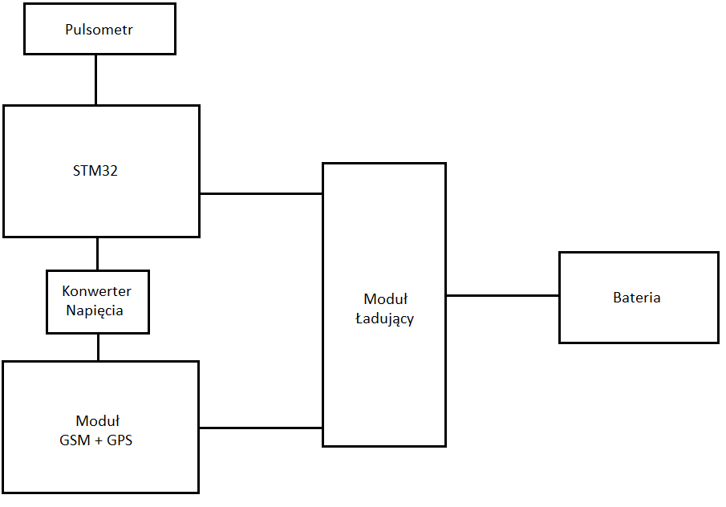

# Monitorowanie bezpieczeństwa osób starszych
wstęp
przegląd literatury
persona
opis techniczny
schemat
algorytm działania
testy
wnioski (weryfikacja poprawność decyzji)

## Wstęp
Definiuje problem, zawiera opis persony.
### Persona
Projekt dotyczy domów spokojnej starości, domów seniora. 
Z jednej strony mamy pacjentów - osoby starsze, które zmagają się z różnymi chorobami, wymagają opieki zdrowotnej, nieustannie należy monitorować ich stan zdrowia. 
Z drugiej strony mamy personel, który sprawuje opiekę nad pacjentami, monitoruje ich stan zdrowia.
### Problem
Dokonywanie manualnie pomiarów pulsu oraz pilnowanie lokalizacji kilkudziesięciu osób starszych w domach opieki dla kilkuosobowego personelu jest niewydajne, drogie i niebezpieczne dla pacjentów.
###  Rozwiązanie problemu
To co rozwiązałoby problem to odciążenie personelu od wykonywania nieustannych pomiarów parametrów zdrowia pacjentów. Do tej pory personel osobiście odszukiwał pacjenta i dokonywał pomiaru używając ciśnieniomierza. Wadami takiego rozwiązania jest czas dotarcia do pacjenta, oraz obciążenie obowiązkiem pomiaru ograniczonej ilości osób, co ogranicza częstotliwość pomiarów i niweluje szanse na wykrycie potencjalnego ryzyka dla zdrowia pacjenta. Pomiary pulsu wykonywane automatycznie przez urządzenie, które pacjent nosiłby przy sobie, zwiększyłoby częstotliwość tych pomiarów. Dodatkowo urządzenie pozwoliłoby na monitorowanie stanu zdrowia pacjentów z jednego miejsca. Urządzenie mogłoby zoptymalizować częstotliwość wykonywania pomiarów, przykładowo zwiększając ją w przypadkach rosnącego ryzyka. Za to w przypadkach, gdzie parametry zdrowia pacjenta nie wskazują na żadne sytuacje zagrażające jego zdrowiu i życiu, pomiary mogły by być dokonywane rzadziej w celu zaoszczędzenia energii. 

Dodatkowym odciążeniem personelu, zwłaszcza w domach opieki z dużym terenem, po którym pacjenci mogą się swobodnie poruszać, byłaby możliwość monitorowania lokalizacji pacjenta. Pozwoliłoby to na ocenę czy pacjent nie oddalił się zbyt daleko lub na natychmiastowe namierzenie pacjenta w sytuacjach krytycznych. 

Automatyzacja pomiarów pozwala na szybsze wykrywanie sytuacji krytycznych, a dostęp do lokalizacji pacjenta przyspiesza czas reagowania na takie sytuacje.

## Opis techniczny
### Schemat
#### Kluczowe elementy
Prototyp urządzenia zawiera trzy kluczowe elementy:
- pulsometr
	- służący do monitorowania pulsu pacjenta
	- częstość pomiarów dostosowana do stanu pacjenta lub skonfigurowana przez personel
- moduł GPS
	- dający możliwość namierzenia lokalizacji pacjenta
	- możliwość konfiguracji okresowego odczytu lokalizacji (link do google maps)
- moduł GSM
	- realizacja komunikacji między personelem, a urządzeniem za pomocą SMS
	- możliwość konfiguracji urządzenia (modyfikacja częstotliwości pomiarów  -> wybór modelu subskrypcyjnego)
#### Architektura rozwiązania

### Algorytm działania
#### Opis słowny
Urządzenie dokonuje pomiarów pulsu domyślnie co 5 minut. Jeśli puls uznawany jest za mieszczący się w normie, urządzenie na podany numer (należący do osoby z personelu) wysyła co godzinę wartość średnią pulsu z ostatniego okresu pomiarowego. Jeśli wartość pulsu odbiega od normy pomiary wysyłane są do personelu za każdym razem. Dodatkowo personel może zwiększyć ich częstość. Gdy wartość pulsu zostaje uznana za krytyczną, częstość pomiarów wraz wysyłaniem rośnie do 1 min.
Domyślnie lokalizacja urządzenia wysyłana jest na żądanie personelu, aczkolwiek możliwe jest ustawienie pewnego rodzaju subskrypcji, która pozwala na otrzymywanie lokalizacji co określony interwał czasu.
#### Protokół konfiguracji urządzenia za pomocą SMS
Konfiguracja SMS pozwala na:
- dodanie/usunięcie numeru telefonu, na który wysyłane są pomiary
- ustawienie interwału częstości dokonywania pomiarów pulsu
- ustawienie zakresu wartości pulsu uznawanego za normę
- ustawienie czasu okresu pomiarowego pulsu
- zażądanie lokalizacji urządzenia
- włączenie/wyłączenie subskrypcji na lokalizację urządzenia wraz z interwałem co ile ma być ona przesyłana
##### Dodanie numeru telefonu, na który wysyłane są pomiary
`tel add <xxx xxx xxx>`
Parametry:
`xxx xxx xxx` - numer telefonu, na który wysyłane mają być pomiary
Działanie:
Urządzenie przechowuje listę numerów, na które wysyłane są wiadomości SMS po pomiarze. Komenda powoduje dodanie numeru do listy.
##### Usunięcie numeru telefonu, na który wysyłane są pomiary
`tel delete <xxx xxx xxx>`
Parametry:
`xxx xxx xxx` - numer telefonu, który ma zostać usunięty z listy numerów na które wysyłane są wiadomości SMS po pomiarze.
Działanie:
Urządzenie przechowuje listę numerów, na które wysyłane są wiadomości SMS po pomiarze. Komenda powoduje usunięcie numeru z listy.
##### ustawienie interwału częstości dokonywania pomiarów pulsu
`pulse interval <pulse_time>`
Parametry:
`pulse_time` - czas w minutach, co który dokonywane będą pomiary pulsu
Działanie:
Urządzenie, co określony czas w parametrze `pulse_time` dokonuje pomiaru pulsu. Pomiary są zapisywane, a po minięciu czasu określonego w `pulse_cycle_time`, wysyłane i kasowane z lokalnej pamięci urządzenia.
##### Ustawienie czasu okresu pomiarowego pulsu
`pulse cycle <pulse_cycle_time>`
Parametry:
`pulse_cycle_time` - czas w minutach stanowiący okres pomiarowy pulsu
Działanie:
Urządzenie, co określony czas w parametrze `pulse_time` dokonuje pomiaru pulsu. Pomiary są zapisywane, a po minięciu czasu określonego w `pulse_cycle_time`, wysyłane i kasowane z lokalnej pamięci urządzenia.
##### Ustawienie zakresu wartości pulsu uznawanego za normę
`pulse norm <min> <max>`
Parametry:
`min` - minimalna wartości pulsu uznawana za normę
`max` - maksymalna wartości pulsu uznawana za normę
Działanie: 
Urządzenie dokonując pomiaru pulsu sprawdza czy jego wartość mieści się w normie. Jeśli tak nie jest `pulse_time` ustawiany jest na jedną minutę, a wiadomości SMS wysyłane są za każdym pomiarem.
##### Zażądanie lokalizacji urządzenia
`loc req`
Działanie:
Po otrzymaniu wiadomości urządzenie odczytuje lokalizację za pomocą modułu GPS, generuje link do Google Maps //TODO{sprawdzić jak to się robi, czy nie jest to płatne itp. https://stackoverflow.com/questions/1801732/how-do-i-link-to-google-maps-with-a-particular-longitude-and-latitude} i wysyła go w odpowiedzi na wiadomość.
##### Włączenie subskrypcji na lokalizację urządzenia 
`loc on <loc_time>`
Parametry:
`loc_time` - czas co jaki urządzenie wysyła swoją lokalizacje na numer telefonu, który zażądał subskrypcji.
Działanie:
Po otrzymaniu wiadomości urządzenie ustawia timer na wartość określoną w `loc_time` i za każdym razem, gdy resetem timer'a, generuje link z lokalizacją do Google Maps i wysyła go na numer, który zażądał subskrypcji.
#### Wyłączenie subskrypcji na lokalizacje urządzenia
`loc off`
Działanie:
Po otrzymaniu wiadomości urządzenie wyłącza timer subskrypcji powiązanej z numerem telefonu, z którego wysłano wiadomość.
